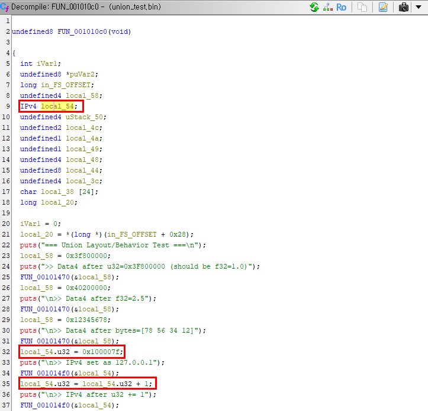

# Union API Test

## 대상
- 바이너리: union_test.bin
- 소스코드: union_test.c
- 세부 대상: Union IPv4
    ```c
    // IPv4 표현 테스트용 유니온
    typedef union {
        uint32_t     u32;
        unsigned char b[4];
    } IPv4;

    int main(void) {
        ...
        IPv4 ip = {0}; // <-- 심볼 적용 대상 변수
        ip.b[0] = 127; ip.b[1] = 0; ip.b[2] = 0; ip.b[3] = 1;
        printf("\n>> IPv4 set as 127.0.0.1\n");
        print_ipv4(&ip);

        ip.u32 += 1;
        printf("\n>> IPv4 after u32 += 1\n");
        print_ipv4(&ip);
        ...
    }
    ```

## 테스트 순서

1. 얼라인먼트(선택)
    - `http://localhost:8080/set_union_alignment?unionName=IPv4&minAlignment=1&machineAligned=false`

2. u32 멤버 추가 (uint32_t)
    - `http://localhost:8080/add_or_update_union_member?unionName=IPv4&fieldTypeStr=u32&fieldName=u32`

3. b 멤버 추가 (unsigned char[4])
    - `http://localhost:8080/add_or_update_union_member?unionName=IPv4&fieldTypeStr=unsignedchar[4]&fieldName=b`

4. 생성 결과 확인
    - `http://localhost:8080/get_union_info?unionName=IPv4`

5. 목록/삭제 테스트
    - 목록: `http://localhost:8080/list_unions?startIndex=0&limit=100`
    - 멤버 삭제: `http://localhost:8080/delete_union_member?unionName=IPv4&fieldName=b`
    - 유니온 삭제: `http://localhost:8080/delete_union?unionName=IPv4`
    > 메모: 타입 토큰은 공백 없는 `unsigned char`를 사용해야 파서가 인식합니다. (`unsigned char` X)

## 테스트 결과


